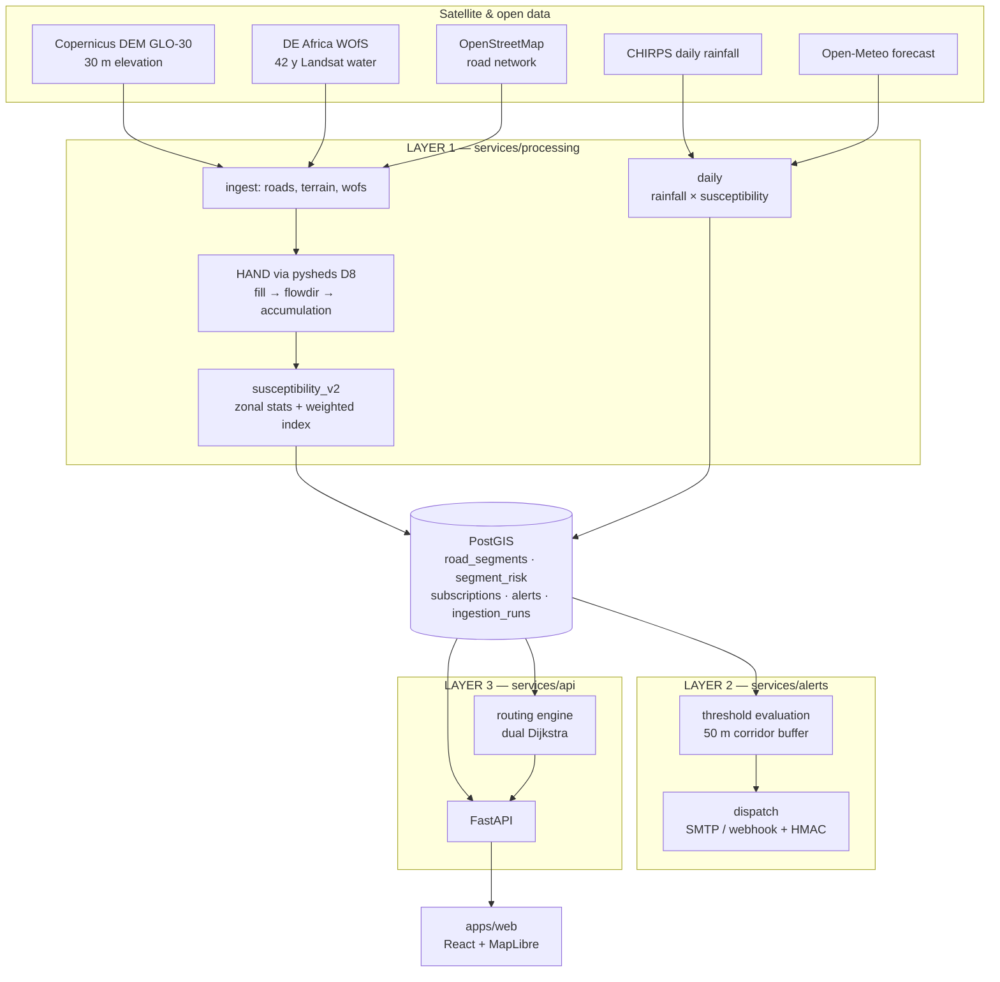

# ClimatePass AI (MVP BLUEPRINT)

**Road-network flood exposure for Abuja FCT.** Every arterial road segment is scored daily from satellite terrain, four decades of satellite water observations and rainfall. The API returns a risk score, a safer alternative route, and threshold alerts on corridors you watch.

Built for the **NigComSat Accelerator 3.0 EO Hackathon**.

---

## The problem

Abuja floods every wet season, and the damage is not evenly distributed. Some roads become impassable at 30 mm of rain; others a kilometre away never do. The difference is terrain — how far a road sits above the nearest drainage channel — and that is measurable from space.

Today a driver, a logistics dispatcher, or a state emergency officer finds out which roads have gone under by driving into one, or by a WhatsApp message after the fact. There is no map of *which* roads, *how badly*, or *what to take instead*.

## What this does

- Scores **42,914 road segments** (~88 m each, 3,772 km of arterial network) for flood susceptibility from terrain and satellite water history
- Layers **daily rainfall** on top to produce a 0–100 risk score per segment per day
- Returns a **risk-aware route**: the fastest way, the safer way, and the computed cost of choosing safety
- **Alerts** on user-defined corridor thresholds, with a 6-hour debounce

Everything is inspectable: `GET /v1/meta/model` publishes the live weights, formula, data provenance and known limitations — the same constants the pipeline applies.

---

## Architecture



### The three layers are physically separate

Required by the hackathon brief §10, and real in the build graph — each service has its own `pyproject.toml` and its own dependency set, not just its own folder.

| Directory | Layer | Responsibility |
|---|---|---|
| `services/processing` | 1 | EO ingestion, spatial processing, scoring |
| `services/alerts` | 2 | Thresholds, subscriptions, notification dispatch |
| `services/api` | 3 | Public REST API |
| `packages/core` | — | Shared config, models, DB session, model card |
| `apps/web` | — | React frontend |

`services/alerts` invokes scoring as a subprocess rather than importing it, so layer 2 never depends on layer 1.

---

## Setup

Requires Docker and ~3 GB of disk. Nine commands:

```bash
git clone <repo> && cd climatepass_ai
cp .env.example .env                      # 1
make up                                   # 2  build and start everything
make db-init                              # 3  apply the schema

docker compose exec processing python -m processing.ingest.roads     --city abuja --variant municipal   # 4
docker compose exec processing python -m processing.ingest.terrain   --city abuja --variant municipal   # 5
docker compose exec processing python -m processing.ingest.wofs      --city abuja --variant municipal   # 6
docker compose exec processing python -m processing.scoring.susceptibility_v2 --city abuja              # 7
docker compose exec processing python -m processing.scoring.daily    --city abuja                       # 8

make smoke                                # 9  verify the whole demo path
```

API on `localhost:8000` (docs at `/docs`), web on `localhost:5173`, Postgres on host port **5434**.

> **Step 5 downloads ~90 MB** of Copernicus DEM as windowed COG reads. Everything caches to `data/cache/`, so subsequent runs are offline.

### Useful targets

```bash
make test          # 39 tests across all three layers
make smoke         # full demo path, ~2 s
make demo-up       # DEMO_MODE on an air-gapped network
make demo-verify   # prove the demo works with no internet at all
make dump-db       # seed dump for production
make help          # everything
```

---

## How the risk score is computed

Two stages. **Susceptibility** is static and says *where* water collects. **Daily risk** layers rainfall on top and says *whether there is water to collect.*

### Stage 1 — susceptibility

Each term is percentile-ranked across the city before weighting, so the index is a relative ordering of this road network, not an absolute depth prediction we cannot honestly make.

| Term | Weight | Why |
|---|---|---|
| `1 − pctile(hand_min)` | **0.40** | Height Above Nearest Drainage. The strongest single predictor: a road 2 m above a channel floods, the same road 40 m above it does not. **Minimum** over the segment because a road is impassable at its lowest point. |
| `pctile(wofs_freq_max)` | 0.25 | How often satellite observed water there across 42 years. Sampled over a **200 m** buffer, not 15 m — it measures the floodplain the road sits in, not the road surface, which is dry by construction. |
| `1 − pctile(slope_mean)` | 0.15 | Flat ground ponds; steep ground drains. |
| `1 − pctile(dist_to_drainage)` | 0.15 | Proximity to a channel. Distinct from HAND: a road can be near a channel but well above it. |
| `crosses_drainage` | 0.05 | Culverts and low-water crossings are where roads actually fail. |

### Stage 2 — daily risk

```
base    = susceptibility_pctile / 100
wetness = min(rain_7d_mm / 120, 1)
trigger = min(rain_24h_forecast_mm / 50, 1)

risk    = 100 × clip(0.50·base + 0.20·wetness + 0.30·(base × trigger), 0, 1)
```

The `base × trigger` interaction is deliberate. Heavy rain on high ground is not the same event as heavy rain in a floodplain, and a purely additive model cannot express that difference.

**Bands:** 0–33 Low · 34–66 Medium · 67–100 High

### Route risk

```
route_risk = 0.6 × max(segment_risk) + 0.4 × length_weighted_mean(segment_risk)
```

Not a plain mean. One impassable segment ruins a route, and averaging would hide exactly the thing the user needs to know.

The safer route is a second Dijkstra pass over `travel_time × (1 + λ·(risk/100)²)`. Squaring tolerates mild risk and rises sharply for severe risk, matching how drivers behave — they ignore a puddle and refuse a flooded underpass. λ defaults to 3.0 and is a request parameter. **λ = 0 reproduces the fastest route exactly.**

Segments at or above risk 70 cost 50× rather than being deleted: deleting can disconnect the graph and return no route, which is a worse answer than a bad route clearly marked.

---

## Results

Measured on **2026-08-02** (88.5 mm antecedent, 17.3 mm following day, both observed):

```
Gwarinpa → Kubwa            distance    time    route_risk
  fastest                    21.2 km   13.7m          72.8
  safest                     30.0 km   25.8m          64.2
  → 12 minutes for 11.8% lower risk
```

The model agrees with local knowledge in both directions. Most susceptible: **Abuja–Keffi Expressway** (HAND 1.9 m), **Mpape–Shishipe** (1.8 m), and the Jabi/Utako corridor. Least susceptible: **Sunrise Boulevard** (33.1 m), **Maitama Roundabout** (28.4 m), **Asokoro Roundabout** — the elevated ridge districts.

Correlation of each feature with the final index: HAND **−0.842**, distance-to-drainage −0.702, slope −0.162, WOfS +0.122.

---

## Documentation

| File | For |
|---|---|
| [MODEL.md](MODEL.md) | Features, weights, physical justification, and an honest limitations section |
| [DATA_SOURCES.md](DATA_SOURCES.md) | Every dataset: provider, resolution, latency, licence, required attribution |
| [INTEGRATION.md](INTEGRATION.md) | For integrators: runnable curl for every endpoint, webhook HMAC verification, a complete Python client |
| [DEPLOY_WALKTHROUGH.md](DEPLOY_WALKTHROUGH.md) | Render, click by click — start here to deploy |
| [DEPLOY.md](DEPLOY.md) | Why the deployment is shaped this way; VM + Caddy alternative |
| [NOTES.md](NOTES.md) | Working notes, hard rules, current status |

---

## Attribution

Produced using **Copernicus WorldDEM™-30** © DLR e.V. 2010–2014 and © Airbus Defence and Space GmbH 2014–2018 provided under COPERNICUS by the European Union and ESA; all rights reserved.

Water observations © **Digital Earth Africa** (CC BY 4.0). Road network © **OpenStreetMap** contributors (ODbL). Rainfall: **CHIRPS** (UCSB Climate Hazards Group) and **Open-Meteo** (CC BY 4.0). Full detail in [DATA_SOURCES.md](DATA_SOURCES.md).
